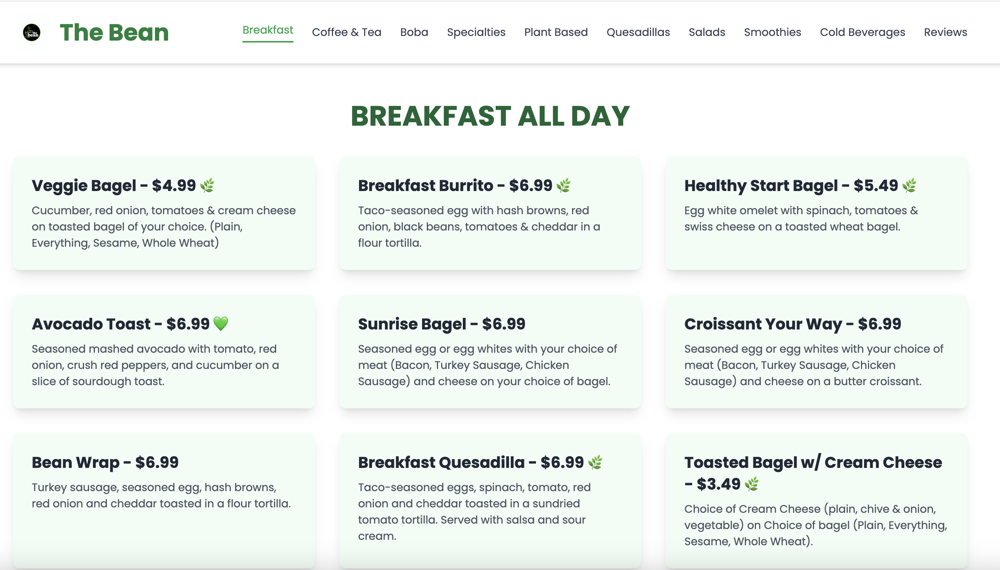
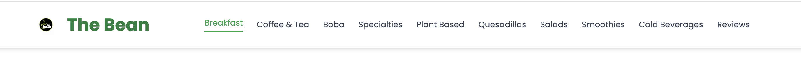

# 🍽️ The Bean Restaurant Website

This is a **fully responsive and professional restaurant website** developed for **The Bean**, located inside **DePaul University’s Gym**.  
Created and designed by **Kuldeep Singh**, voluntarily, using an **Agile development approach**.  

---

## 🌐 Live Website
👉 [**Visit The Bean Restaurant**](https://thebeancafe.netlify.app/)

---

## 💡 Project Overview
The website was developed to help **The Bean Restaurant** improve visibility and attract more customers by showcasing their complete menu and allowing direct customer feedback.  

I gathered all the project requirements directly from the restaurant’s owner, created a prototype for initial approval, and then built the full version with iterative improvements.  
The project was **completed and launched successfully on October 2, 2025**.  

Originally hosted on **GitHub Pages**, it was later moved to **Netlify** for a shorter and more professional domain.  

---

## ✨ Features
- Full menu including **Smoothies, Shakes, Coffee & Tea, Boba Tea, Salads, Breakfast, Specialties, Plant-Based, and Quesadillas**  
- **Vegetarian (✓)** and **Vegan (♥)** labels for clarity  
- **User Review System** integrated using **Google Firebase** as the backend database  
- Modern, **fully responsive layout** with optimized images and smooth navigation  
- Hosted on **Netlify** with a clean, free custom domain  

---

## 🖼️ Screenshots / Preview

### 🏠 Homepage
  
*Showcases the restaurant’s name, logo, and a welcoming banner.*

### 📋 Menu Section
  
*Displays all categories — smoothies, shakes, boba tea, and more, with vegetarian and vegan indicators.*

### 💬 Feedback Section
  
*Allows customers to share their reviews, powered by Google Firebase.*

*(Tip: Store your images inside an `/images` folder in your repository to display them correctly.)*

---

## ⚙️ Technologies Used
| Technology | Usage |
|-------------|--------|
| **HTML** | 74.6% |
| **JavaScript** | 22.5% |
| **CSS** | 2.9% |
| **Firebase** | Used for storing and managing customer reviews |
| **Netlify** | Used for final website hosting and deployment |

---

## 🧠 Development Process
The project was developed using an **Agile methodology**:  
- Requirement gathering from the restaurant owner  
- Prototype design for approval  
- Multiple feedback and improvement iterations  
- Final build and deployment  

I also used **Google Gemini** to assist with content ideas, layout inspiration, and optimization suggestions during development.  

---

## 🎯 Project Insights / Learning Outcomes
Through this project, I gained hands-on experience in:  
- **Full-stack web development fundamentals** (HTML, CSS, JavaScript, Firebase)  
- **Client communication and requirement gathering** for real-world projects  
- **Agile workflow management** and iterative design  
- **UI/UX design** for restaurant and food-service websites  
- **Deployment and hosting** using GitHub Pages and Netlify  
- **Integrating cloud-based databases** with frontend applications  

This project enhanced both my **technical skills** and **client-facing communication abilities**, providing valuable practical exposure to real business needs.

---

## 👨‍💻 Author
**Kuldeep Singh**  
🎓 Master of Information Systems, DePaul University  
🔗 [GitHub Profile](https://github.com/kuldeepsingh343)  
📅 Project Completed: **October 2, 2025**

---

## 📜 License
This project is licensed under the **MIT License** — see the [LICENSE](./LICENSE) file for details.  

---

## 💖 Acknowledgments
I would like to express my sincere gratitude to:  
- **The Bean Restaurant** owner and team for trusting me with this project and providing valuable feedback during development.  
- **Google Gemini** for assisting in brainstorming design ideas, UI/UX improvements, and optimization suggestions.  

